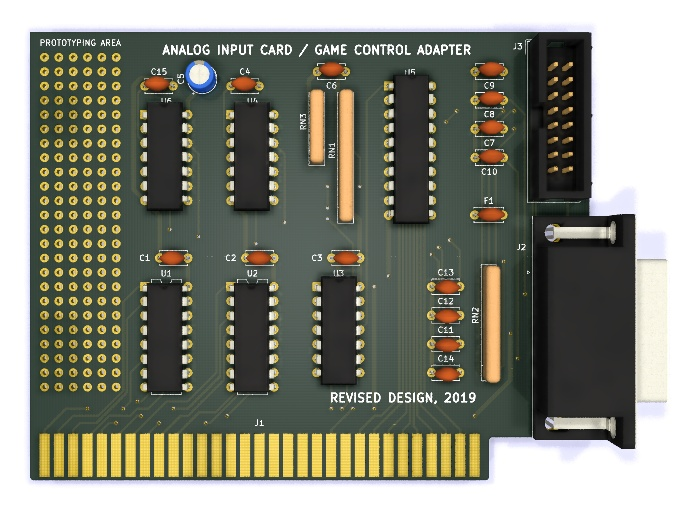

# Game Control Adapter

This is an untested design for an 8-bit ISA card with gameport.
It avoids the use of the obsolete NE558 quad timer IC and uses two NE556 dual timers, instead.

## Front view

This picture shows the front of the card.

## License

The following license applies to the files in this repository:

This work is licensed under the Creative Commons Attribution-ShareAlike 4.0 International License. To view a copy of this license, visit http://creativecommons.org/licenses/by-sa/4.0/ or send a letter to Creative Commons, PO Box 1866, Mountain View, CA 94042, USA.
